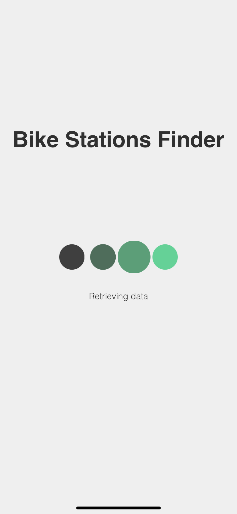
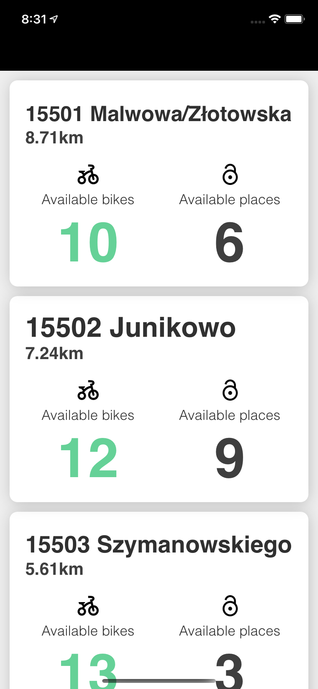
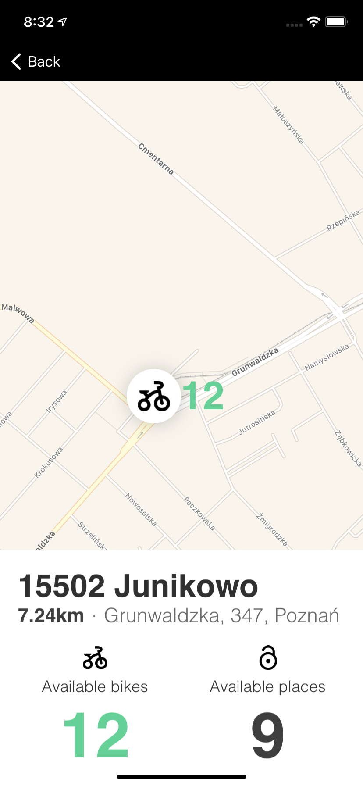
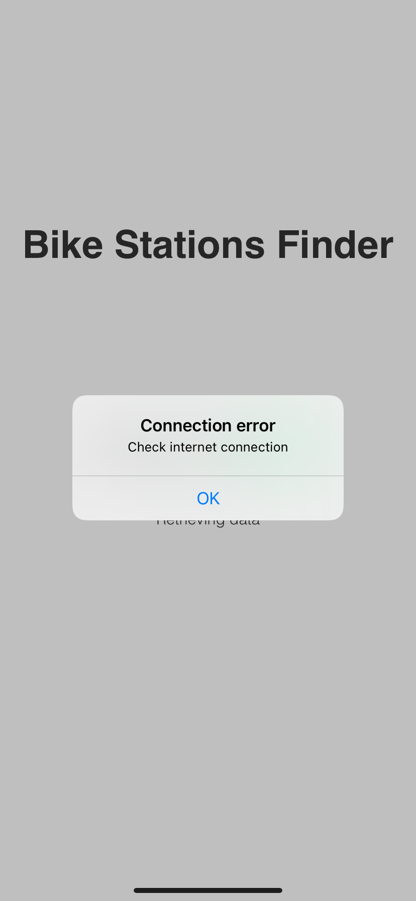

# BikeStationsFinder-iOS-App


## Runtime environment
   

## Technologies
<a href="https://developer.apple.com/swift/">  </a>
<a href="https://developer.apple.com/support/xcode/">  </a>
<a href="https://github.com/Alamofire/Alamofire">  </a>
<a href="https://www.json.org/json-en.html">  </a>
<a href="https://github.com/peripheryapp/periphery">  </a>
<a href="https://github.com/realm/SwiftLint">  </a>
<a href="https://github.com/SnapKit/SnapKit">  </a>

Another:
- animated loading dots: https://github.com/Abedalkareem/AMDots

## Table of contents
* [General info](#general-info)
* [Functionality](#functionality)
* [How to build](#how-to-build)

## General info

iPhone app for displaying bike stations in Poznań

## Functionality

- displaying stations as a list
- showing station on map
- showing distance between user and stations (real time)
- exact address only in map view (reverse geocoding CLGeocoder API calls limit)
- info about each station:
  - number of free bikes
  - number of free racks
  - distance between user and station
  - adress


  <p align="center"> 
  		   
  		   
  		    </p>

## How to build
In app main folder run:
```
pod install
```
After installing dependencies, you can run the project(`BikeStationsFinder.xcworkspace`).

## Demo
<p align="center">  </p>
